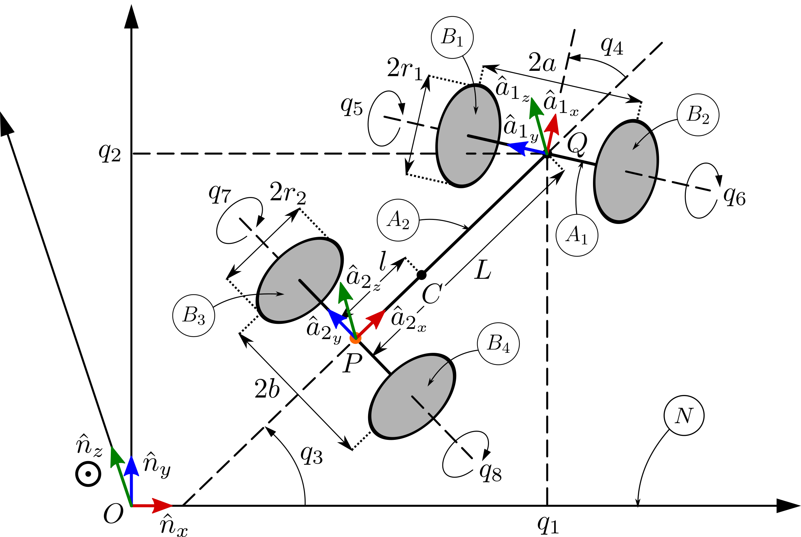

# Rocket-Car

 

  

 

### Modeling of a Variable-Mass Nonholonomic Gyrostatic Rocket Car Using Extended Kane's Equations

 - [__Rendered Jupyter Notebook__](https://nbviewer.jupyter.org/github/abhinavkamath/Rocket-Car/blob/master/Rocket_Car.ipynb?flush_cache=True)

__My implementation of the rocket-engine-powered jet racing car example from [Ge, Z.M. and Cheng, Y.H., 1982] in Python (SymPy/PyDy)__

References:
 1. Ge, Z.M. and Cheng, Y.H., 1982. Extended Kane’s equations for nonholonomic variable mass system.
 1. Kane, T.R., 1978. Nonholonomic multibody systems containing gyrostats. In Dynamics of Multibody Systems (pp. 97-107). Springer, Berlin, Heidelberg.
